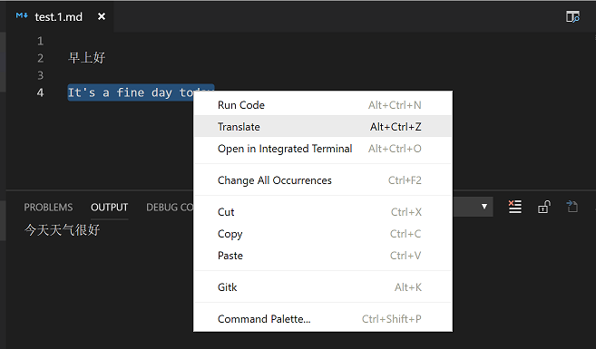

# Translator

  

Translate between English and Chinese.

## Usage

Hover on a word to translate:

Select text to translate:

## Change Log

See Change Log [here](CHANGELOG.md)

## Issues

Currently, the extension is in the very initial phase. If you find any bug or have any suggestion/feature request, please submit the [issues](https://github.com/formulahendry/vscode-translator/issues) to the GitHub Repo.